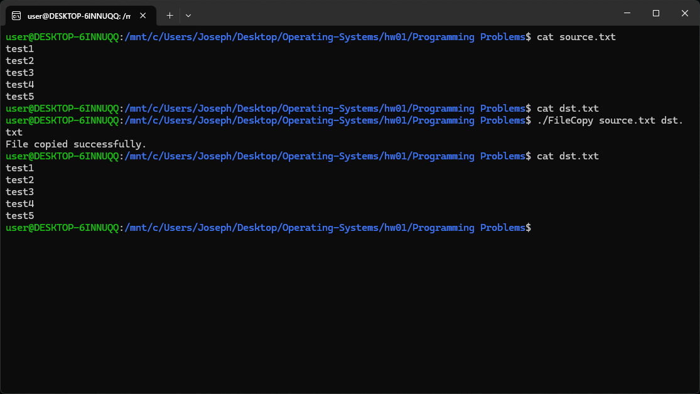

# Programming Problems

## 說明

- `make` 編譯全部作業
- `make 個別題目` 編譯個別題目
- `make clean` 清理

## 2.24 FileCopy

- `make FileCopy` 編譯 FileCopy
- `Usage: ./FileCopy <source file> <destination file>`

## 3.19 time

- `make time_shm` 編譯 time_shm
- `Usage: ./time_shm <command> [args...]`

- `make time_pipe` 編譯 time_pipe
- `Usage: ./time_pipe <command> [args...]`

## 3.20 pid manager

- `make pid_test` 編譯 pid manager 測試
- `Usage:  ./pid_test`

## 3.27 filecopy

- `make filecopy_pipe` 編譯 filecopy_pipe
- `Usage: ./filecopy_pipe <source file> <destination file>`

