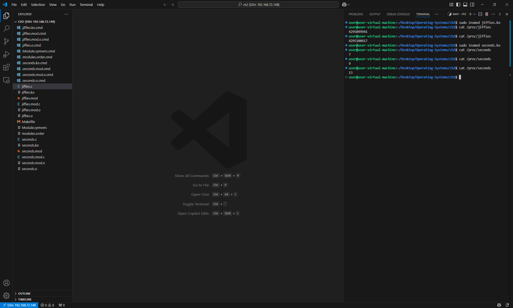
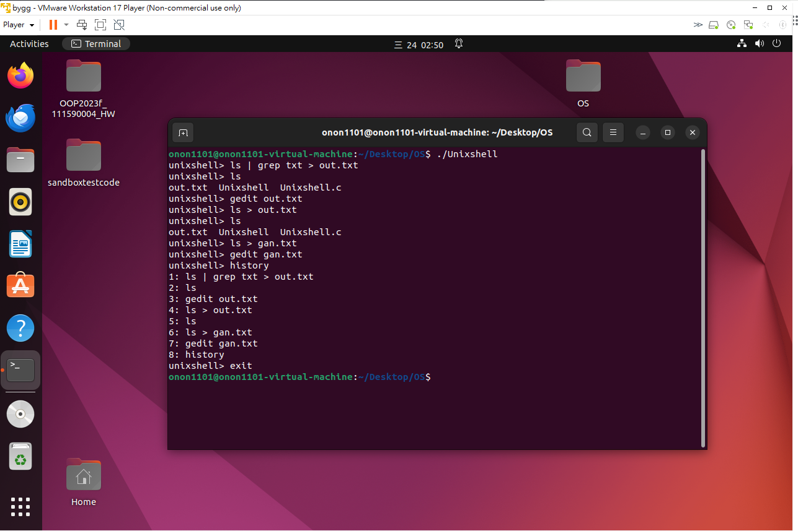

# Programming Project

## Unit 2

> [!NOTE]  
> 在 `Unit 2` 的實作 `Project` 裡面，要建立兩個 `/proc` 並回傳不同的計算數值

### How to Compile

> [!NOTE]
> 輸入 `make` 來產生 `jiffies.ko` 和 `seconds.ko`

### How to use

- 輸入 `insmod jiffies.ko` 掛載 `jiffies`
- 輸入 `cat /proc/jiffies` 獲得 `jiffies` 數值
- 輸入 `insmod seconds.ko` 掛載 `seconds`
- 輸入 `cat /proc/seconds` 獲得 `模組運行秒數`

### Picture

> 以下會附上截圖證明可使用之指令。

## Unit 3

> [!NOTE]  
> 在 `Unit 3` 的實作 `Project` 裡面，我們選擇 `Project 1: UNIX Shell` 進行實作。  
> 這個章節目的是為了模擬一個簡單的 `Shell` 並執行 `Linux` 、 `Unix` 、 `macOS` 等環境指令。

### How to Compile

> [!NOTE]
> 請使用 `gcc Unixshell.c -o Unixshell` 進行編譯。  
> 並且 `./Unixshell` 執行編譯後的程式。

### How to use

- 你可以下 `ls` 來查看當前資料夾的檔案。
- `cat <filename>` 來查看文件內部內容。
- `history` 查看查詢紀錄。
- `exit` 離開程式。

### Picture

> 以下會附上截圖證明可使用之指令。

# 組員名單及貢獻度

- 111590004 張意昌，進行 `Unixshell` 測試並撰寫使用文件。[25%]
- 111590011 吳耀東，進行 `jiffies.c` 測試並撰寫使用文件。[25%]
- 111590012 林品緯，進行 `seconds.c` 測試並撰寫使用文件。[25%]
- 111590028 張睿恩，進行 `Unixshell` 撰寫及問題修復。[25%]
- 每人貢獻皆為 `25%` ，總共為 `100%` 。
