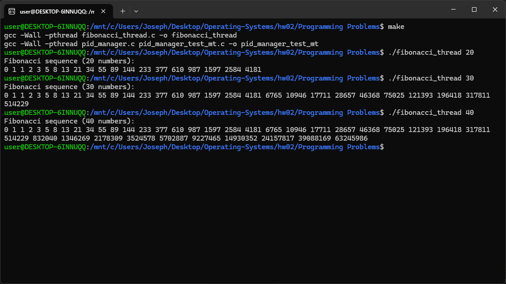
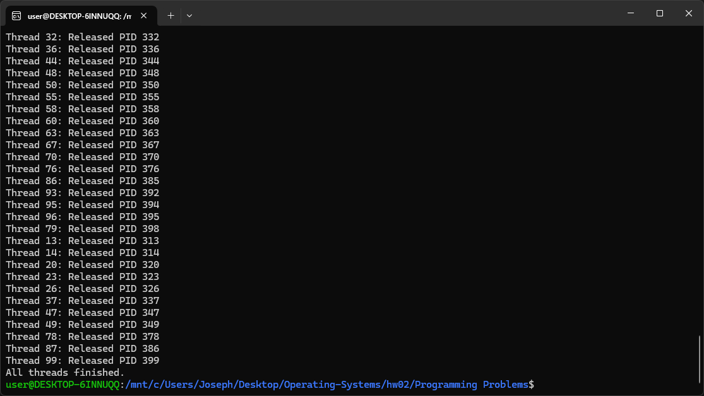

# Programming Problems

## 說明

使用下面指令編譯出可執行檔

```bash
make
```

## 4.27

使用下方指令輸出指令數量的費式數列

```bash
./fibonacci_thread <number of Fibonacci numbers to generate>
```



## 4.28

使用下方指令測試 thread 版本的 pid manager

```bash
./pid_manager_test_mt
```



## 6.33

`6.33.md` 包含問答題答案和修改後的程式碼。
