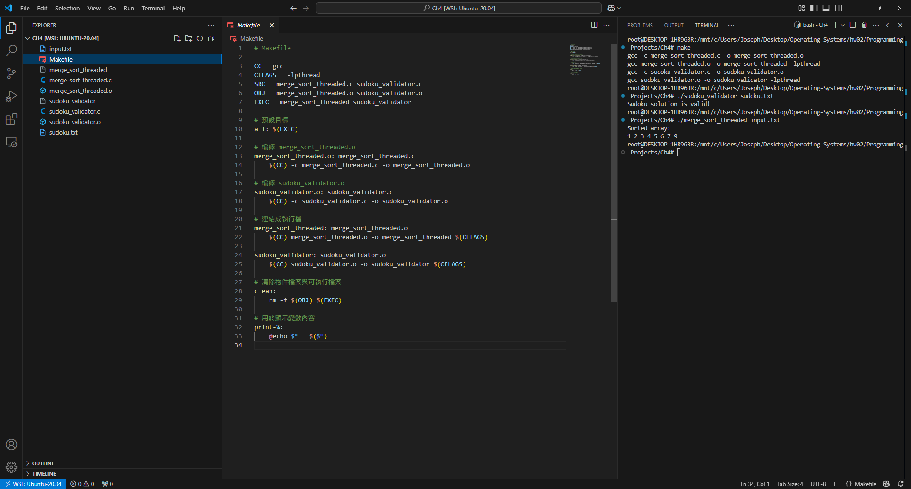
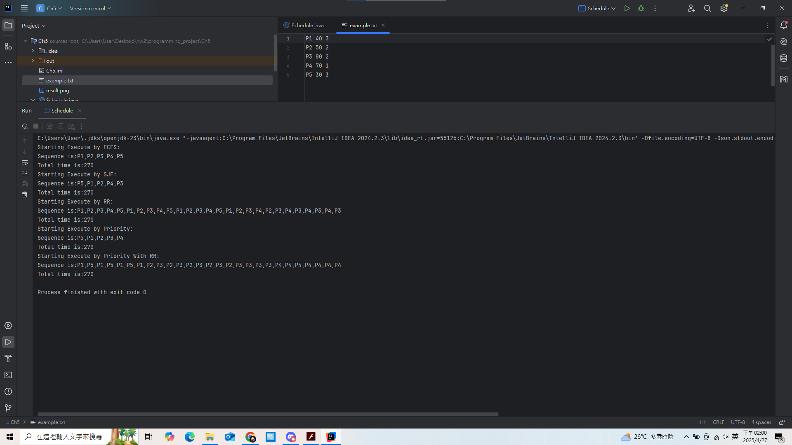

# Programming Project

## Unit 4

> [!NOTE]  
> 在 `Unit 4` 的實作 `Project` 裡面，我們選擇兩個都做。
>
> - Sudoku solution validator
>   - 數獨結果驗證
> - Multithreaded sorting application
>   - 多執行緒排序

### How to Compile

> [!NOTE]
>
> 請使用 `make` 指令自動編譯本專案中包含的程式碼：
>
> - `merge_sort_threaded.c`：多執行緒 Merge Sort，從檔案讀入整數資料並排序。
> - `sudoku_validator.c`：多執行緒驗證 Sudoku 解答是否合法。
>
> 請確認你的作業系統為 Linux，並且有安裝 GCC 編譯器與 POSIX Thread 函式庫。

```bash
make
```

> [!NOTE]
>
> 或是你也可以個別編譯檔案：

```bash
gcc -o merge_sort_threaded merge_sort_threaded.c -lpthread
gcc -o sudoku_validator sudoku_validator.c -lpthread
```

### How to use

#### merge_sort_threaded

> [!TIP]
>
> 透過從檔案讀入整數進行排序，每次會啟動兩個執行緒排序左右兩半，再由第三個執行緒合併排序結果。

```bash
./merge_sort_threaded input.txt
```

> [!TIP]
>
> `input.txt` 檔案格式如下（第一行為數量，第二行為空白分隔整數）：

```
8
9 5 7 2 6 1 3 4
```

#### sudoku_validator

> [!TIP]
>
> 使用多執行緒分別驗證 Sudoku 解答的橫列、直行與 3x3 區塊是否合法。  
> 使用者啟動程式時提供輸入檔名，格式為 9x9 整數陣列。

```bash
./sudoku_validator sudoku.txt
```

> [!TIP]
>
> `sudoku.txt` 範例：

```
5 3 4 6 7 8 9 1 2
6 7 2 1 9 5 3 4 8
1 9 8 3 4 2 5 6 7
8 5 9 7 6 1 4 2 3
4 2 6 8 5 3 7 9 1
7 1 3 9 2 4 8 5 6
9 6 1 5 3 7 2 8 4
2 8 7 4 1 9 6 3 5
3 4 5 2 8 6 1 7 9
```

### Picture

> 以下會附上程式執行畫面截圖，包含：
>
> - Merge Sort 執行排序的過程與結果。
> - Sudoku 驗證成功與否結果。



## Unit 5

> [!NOTE]  
> 在 `Unit 5` 的實作 `Project` 裡面，我們選擇要進行的事情是做 `Scheduling Algorithm` 。
>
> - FCFS (First come first surve)
> - SJF (Short Job First)
> - RR (Round Robin)
> - Priority
> - Priority with RR  
>     - 在這裡，我們將同一個 `priority` 的東西都用 `RR` 處理，即使裡面剩一個 `Process` ，所以他有可能一個 `process` 會跑很多次。  
> - `Priority` 數字越大越優先， `RR` 的 `Quantum` 為 `10` 。  
> - `Priority` 的數字 `1~10` ， 時間最大為 `100` 。  
> - 以上皆參考至 `OS` 老師指定之教科書內容。

### How to Compile

> [!NOTE]  
> 請使用 `javac Schedule.java` 進行編譯。  
> 請在該目錄下面執行，或是使用 `linux` 解決無法讀檔的問題。  
> 如果要使用 `jetbrain` 或是其他 `ide` 執行，請確保執行在 `Ch5` 這個資料夾下面。  
> `example.txt` 是任務的內容，你可以自行新增任務。  
> `PX <burst time> <priority>` 代表第幾個任務、時間、優先權。

### How to use

> [!TIP]
> 使用 `java Schedule <argument>` 執行編譯後的程式。  
> `<argument>` 包含以下內容：  
> `FCFS`代表 `FCFS (First come first surve)`  
> `SJF` 代表 `SJF (Short Job First)`  
> `Priority` 代表 `Priority`  
> `RR` 代表 `RR (Round Robin)`  
> `PriWRR` 代表 `Priority with RR`  
> `All` 代表 `以上都跑一次`

### Picture

> 以下會附上截圖證明專案可編譯，以及執行結果 (以 `All` 為範例) 。  
> 會告訴使用者使用啥演算法進行排程，並且列印工作順序，以及總執行時間。



# 組員名單及貢獻度

- 111590004 張意昌，進行 `Ch5 Scheduling Algorithm` 程式撰寫。[25%]
- 111590011 吳耀東，進行 `Ch4 Sudoku solution validator` 撰寫程式和使用文件。[25%]
- 111590012 林品緯，進行 `Ch4 Multithreaded sorting application` 撰寫程式和使用文件。[25%]
- 111590028 張睿恩，進行 `Ch5 Scheduling Algorithm` 文件撰寫及測試。[25%]
- 每人貢獻皆為 `25%` ，總共為 `100%` 。
