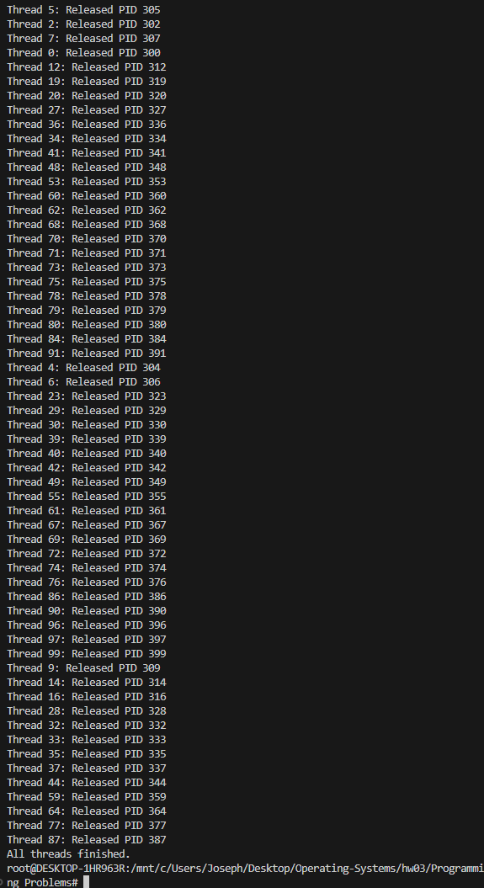

# Programming Problems

## 說明

使用下面指令編譯出可執行檔

```bash
make
```

## 7.14

使用下方指令測試 mutex locks 版本的 pid manager

```bash
./pid_manager_test_mt
```


## 7.15

使用下方指令輸出指令數量的費式數列

```bash
./fibonacci_thread <number of Fibonacci numbers to generate>
```


## 8.32

使用下方指令模擬農夫過橋

```bash
./farmer_bridge
```


## 9.28 

使用下方指令計算 page 和 offset

```bash
./address <virtual address>
```

