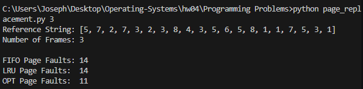
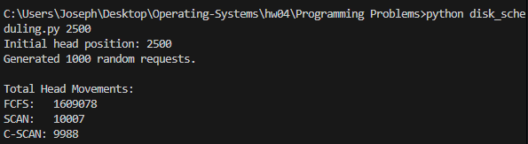

# Programming Problems

## 說明

- Platform：Windows
- Programming language：Python

## 10.44

使用下方指令運行 page replacement 不同演算法

```bash
python page_replacement.py <number_of_frames>
```



## 11.27

使用下方指令運行 disk scheduling 不同演算法

```bash
python disk_scheduling.py <initial_head_position>
```


